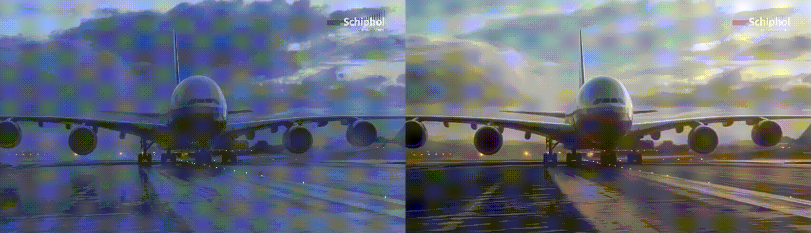

## RelightFlow: An Inversion-Free Video Relighting Model via Dual-Trajectory Diffusion Editing

This repository is the official implementation of **RelightFlow**, a training-free framework for zero-shot video relighting that achieves stronger temporal stability and higher detail fidelity compared to existing methods.

Click for the full abstract of RelightFlow

> Video relighting is a fundamental task with wide-ranging applications in contemporary visual computing, including film production, immersive virtual reality, augmented reality, and interactive digital worlds. Its objective is to generate temporally stable lighting effects while preserving the structural integrity, visual appearance, and intrinsic physical properties of objects in the source video. Recent studies combined image relighting models with video diffusion models, achieving notable progress in training-free video relighting. However, these methods rely on mapping noisy latents back to the pixel space during the relighting process, leading to degraded fidelity, consistency, and stability. In this work, we propose RelightFlow, a training-free video relighting framework built upon a flow-matching-based video DiT model, which requires neither inversion nor additional training, obtaining more feasible and robust relighting effects. Specifically, we first design a detail-preserving relighting module coupled with an interpolation trajectory, which injects stable lighting cues in the early generation stages while maintaining fine spatial details. Next, we develop a temporally consistent relighting module to form a flow-editing trajectory, leveraging the velocity fields predicted by the video DiT model to enhance temporal coherence. Finally, we introduce a dynamic fusion strategy that adaptively integrates these two trajectories to balance relighting intensity and temporal stability. Extensive experiments demonstrate that RelightFlow achieves high-quality video relighting with stable relighting intensity, superior fidelity, and temporal consistency.

## 🎥Demo
https://github.com/user-attachments/assets/f5b03375-fc6a-4074-a96f-1b6955be19fa

---
<table class="center">
    <tr>
      <td>
..., cyberpunk red and blue neon light at city night.
</td>
      <td>
..., high contrast lighting under noon sun.
</td>
    </tr>
    <tr>
      <td></td>
      <td></td>
    </tr>
    <tr>
      <td>
..., sharsh midday direct sunlight.
</td>
      <td>
..., in the forest, golden hour sunlight shining on the beach, players' shadows stretching long.
</td>
    </tr>
    <tr>
      <td></td>
      <td></td>
    </tr>
</table>

## Method Overview

RelightFlow is a training-free video relighting framework built upon a flowmatching video generation model. This framework is capable of producing temporally consistent, high-fidelity relighted videos without the need for additional training or optimization. First, we perform relighting directly in the noise-free latent space, avoiding noise inversion processes that often degrade content quality and introduce structural distortions. Second, we treat the diffusion model not merely as a denoising tool but as an effective editing mechanism, fully exploiting its ability to achieve consistent illumination adjustments. Third, we formulate relighting strategies within the latent variable space, which enhances the coherence of the relighting process and allows for efficient integration of contextual and semantic information, thereby reducing spatial distortions and framelevel blurring.

## Installation

## Citation

## 

